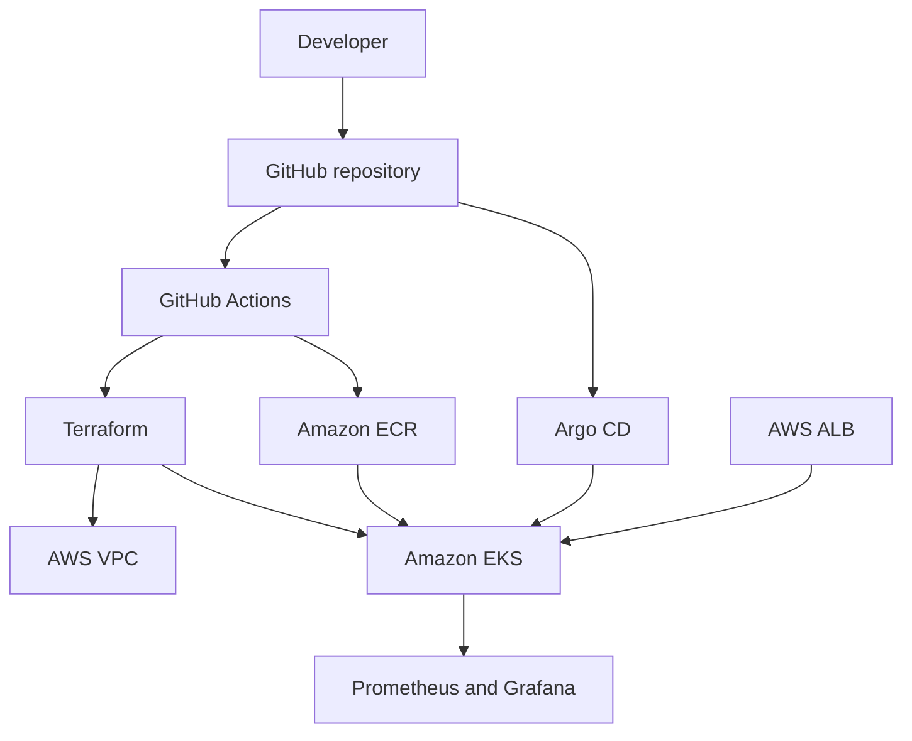

# Production EKS Platform

A production-style Amazon EKS platform built with Terraform, Kubernetes, Helm, GitHub Actions, Argo CD, Prometheus and Grafana.

## Project goals

- Provision reusable AWS infrastructure with Terraform modules.
- Run workloads on Amazon EKS using managed node groups.
- Deploy applications through Helm and Argo CD GitOps.
- Expose applications through the AWS Load Balancer Controller.
- Add automated validation, security scanning and policy checks.
- Monitor the platform with Prometheus and Grafana.
- demonstrate cost allocation, rightsizing and scaling practices.

## Planned architecture



## Repository structure

```text
.
├── .github/workflows/       GitHub Actions workflows
├── apps/                    Application source and container files
├── argocd/                  Argo CD applications
├── docs/                    Architecture, decisions and runbooks
├── helm/                    Application Helm charts
├── kubernetes/              Platform Kubernetes manifests
├── monitoring/              Prometheus and Grafana configuration
├── policies/                Security and policy-as-code rules
└── terraform/
    ├── bootstrap/           Remote-state resources
    ├── environments/        Environment-specific root modules
    └── modules/             Reusable infrastructure modules
```

## Environments

The project starts with a `dev` environment. Infrastructure is structured so that staging or production environments can be added later without duplicating reusable modules.

## Current status

- [x] Repository created
- [x] Initial project structure documented
- [ ] Terraform remote-state bootstrap
- [ ] VPC networking
- [ ] Amazon ECR
- [ ] Amazon EKS and managed node groups
- [ ] Helm application deployment
- [ ] GitHub Actions CI/CD
- [ ] Argo CD GitOps
- [ ] AWS Load Balancer Controller
- [ ] Prometheus and Grafana
- [ ] Security and cost controls

## Cost safety

Validation stages do not create AWS resources. Any live deployment step will be clearly marked because EKS, NAT gateways, load balancers and worker nodes can incur charges.

## Licence

This project is licensed under the MIT License. See `LICENSE`.